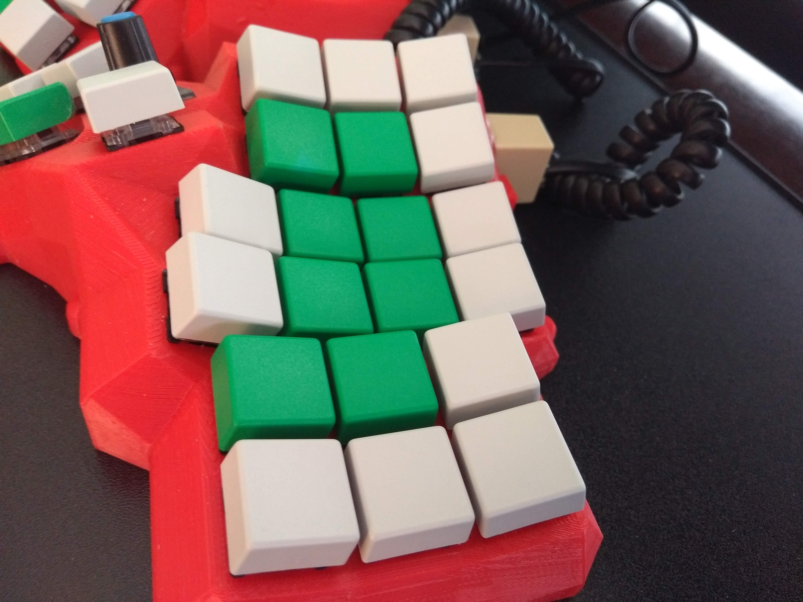
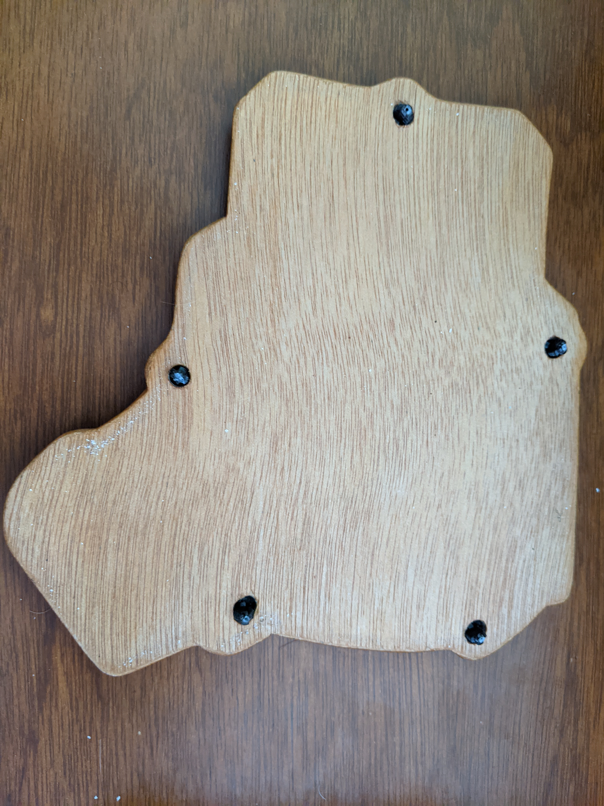
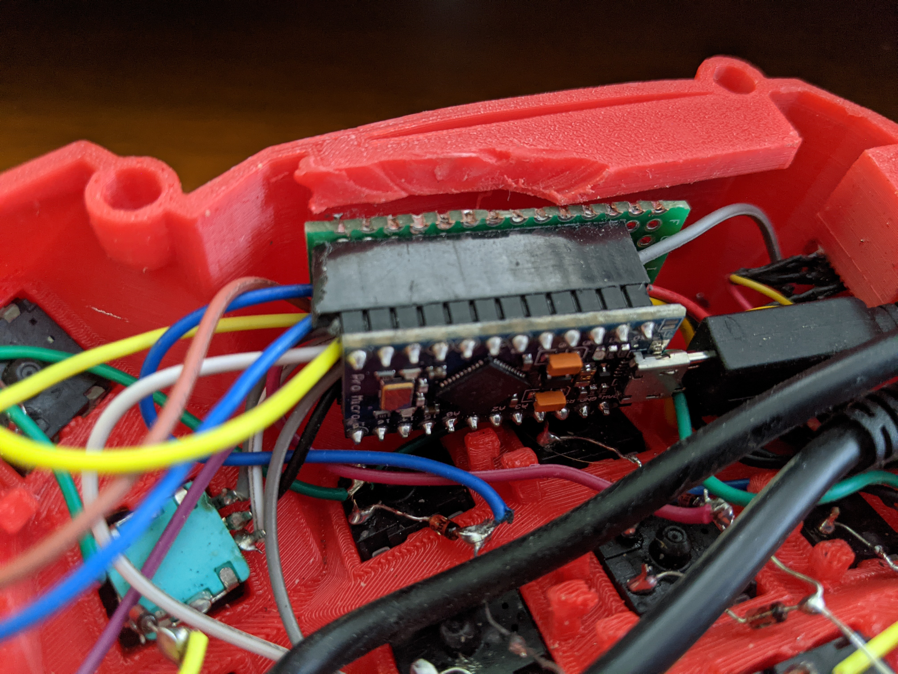
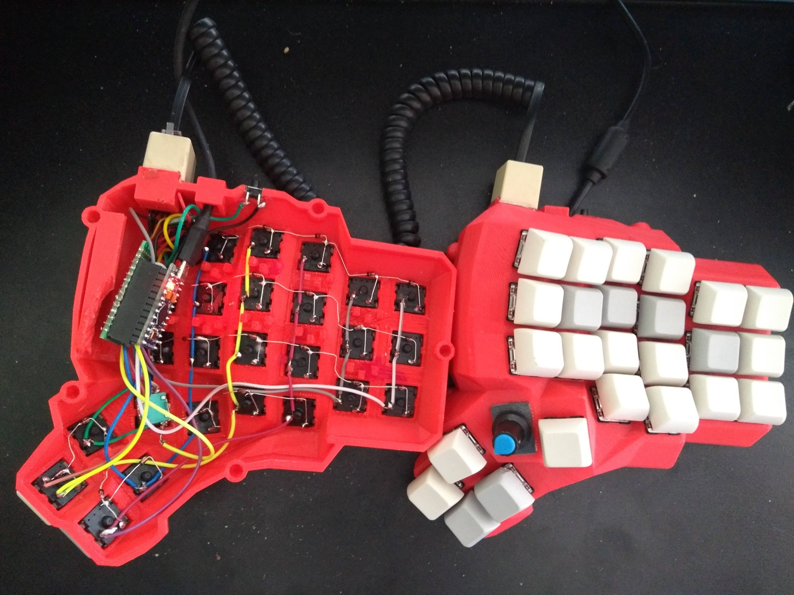
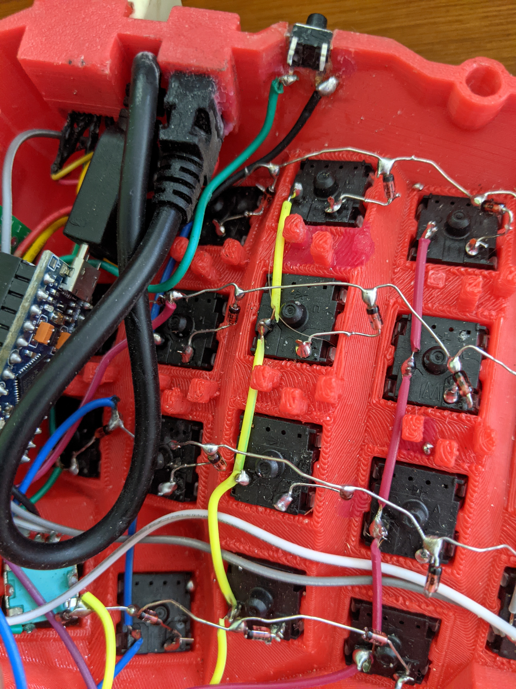
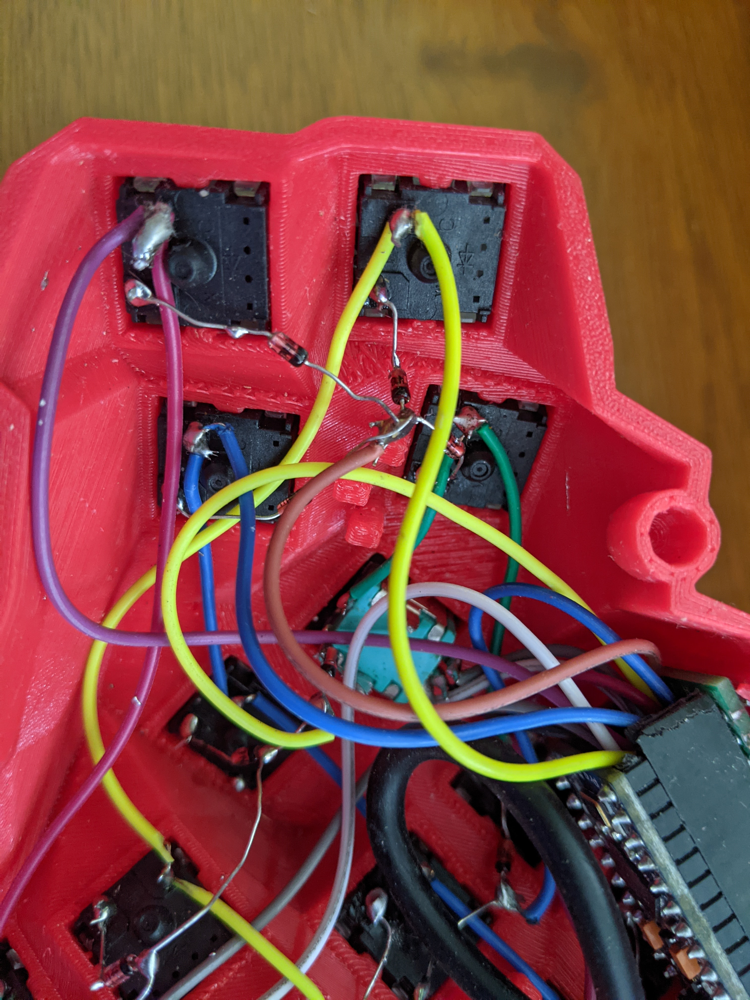
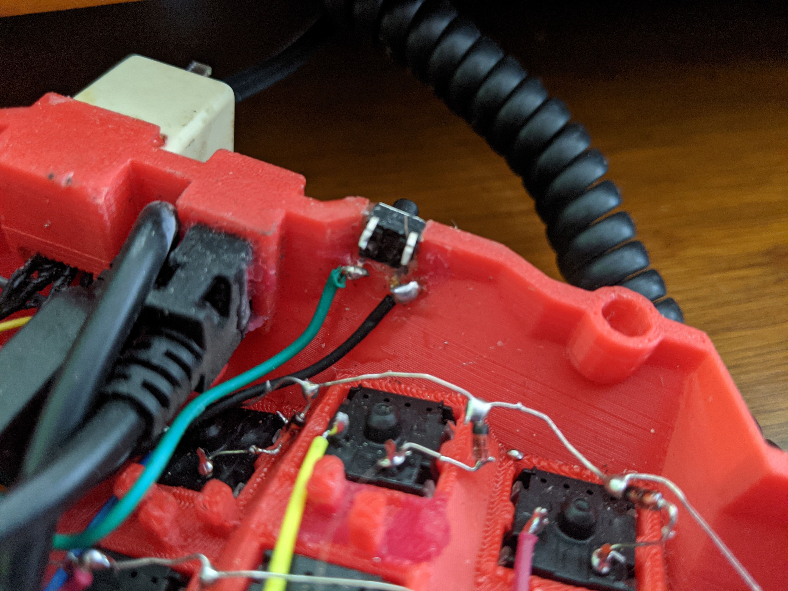

# I'm a Maker! How to Build Your Keyboard(s)

During the COVID-19 pandemic, I relaxed by building keyboards. The lockdown/lock-in took longer than expected, so I could test various kits and mods, and also built a hand-wired keyboard. These boards are:

- **Kyria**: A split keyboard with 50 keys; optionally, two keys can be replaced by rotary encoders. As well, you can add two OLED displays. Overall, the Kyria provides many possibilities and has good support by its creator in Discord.
- **Corne**: This is a real classic split keyboard. I'm writing these lines on a Corne with Plover steno. My board has 3 x 6 keys and 3 thumb keys on each side. A little OLED screen on the left side informs about the active layer, the right screen is only decorative at the moment and has no further function. You can find different PCB designs from diverse providers.
- **JJ40**: I might be wrong, but to me the JJ40 seems a clone of the Planck, which is a classic 40% non-split keyboard with 4x12 switches. There are many offers of through-hole and SMD PCBs, and other accessories, such as cases.
- **Dactyl Manuform**: A 3D printed split keyboard with focus on an ergonomic design. There are different versions published. However, building a Dactyl Manuform needs some technical skills and may be less suitable for beginners. I will show the building of a Dactyl Manuform below, because it shows all technical aspects that might be relevant for keyboard makers.

> **Hack:** Unless you know what you are doing, get a keyboard kit from a reliable provider. Also check if there is support, either by the provider or by the community. After building and programming your first keyboard, you can be more brave!

[https://github.com/abstracthat/dactyl-manuform](https://github.com/abstracthat/dactyl-manuform)

## Components

### Essential Components

#### PCBs (or Manual Cabling)

#### Switches

#### Keycaps

#### Diodes

#### Microprocessor

### Optional Components

#### Rotary Encoders

Rotary encoders function as switches (keys) and additionally can be used for a left/right adjustment of values. Thus, they can be used, e.g., for volume control or scrolling.

#### OLEDs

Extra information, such as the typing speed or the chosen layer, can be displayed on OLED screens.

#### LEDs

For keyboard illumination.

## Manual Build of a Dactyl Manuform Keyboard

The Dactyl Manuform is a challenging but rewarding build that demonstrates all the key aspects of hand-wiring a split keyboard. Below is a visual guide to the construction process.

<figure style="text-align: center; margin: 1.5em 0; padding: 0.5em; border: 1px solid #eee; background-color: #f9f9f9; border-radius: 4px; max-width: 100%;">
  
  <figcaption style="font-style: italic; font-size: 0.9em; color: #555; margin-top: 0.5em; padding: 0.3em; background-color: #f0f0f0; border-radius: 0 0 4px 4px;">
    The distinctive 3D-printed case with ergonomic sculpting for each hand.
  </figcaption>
</figure>

### 3D-Printed Case

The Dactyl Manuform case is 3D printed in two halves (left and right). The design is parametrizable, allowing you to adjust the shape, tenting angle, and other ergonomic features to your preferences.

<figure style="text-align: center; margin: 1.5em 0; padding: 0.5em; border: 1px solid #eee; background-color: #f9f9f9; border-radius: 4px; max-width: 100%;">
  
  <figcaption style="font-style: italic; font-size: 0.9em; color: #555; margin-top: 0.5em; padding: 0.3em; background-color: #f0f0f0; border-radius: 0 0 4px 4px;">
    The case can be mounted on a wooden base for additional stability.
  </figcaption>
</figure>

### Placing the Microcontrollers

Each half of the keyboard requires its own microcontroller (typically a Pro Micro or similar).

<figure style="text-align: center; margin: 1.5em 0; padding: 0.5em; border: 1px solid #eee; background-color: #f9f9f9; border-radius: 4px; max-width: 100%;">
  
  <figcaption style="font-style: italic; font-size: 0.9em; color: #555; margin-top: 0.5em; padding: 0.3em; background-color: #f0f0f0; border-radius: 0 0 4px 4px;">
    Arduino Pro Micro controllers placed in their slots in the 3D-printed case.
  </figcaption>
</figure>

### Wiring the Matrix

Hand-wiring requires patience and precision. Each switch needs to be connected in a matrix pattern.

<figure style="text-align: center; margin: 1.5em 0; padding: 0.5em; border: 1px solid #eee; background-color: #f9f9f9; border-radius: 4px; max-width: 100%;">
  
  <figcaption style="font-style: italic; font-size: 0.9em; color: #555; margin-top: 0.5em; padding: 0.3em; background-color: #f0f0f0; border-radius: 0 0 4px 4px;">
    Overview of the hand-wiring. Each column and row is carefully soldered.
  </figcaption>
</figure>

<figure style="text-align: center; margin: 1.5em 0; padding: 0.5em; border: 1px solid #eee; background-color: #f9f9f9; border-radius: 4px; max-width: 100%;">
  
  <figcaption style="font-style: italic; font-size: 0.9em; color: #555; margin-top: 0.5em; padding: 0.3em; background-color: #f0f0f0; border-radius: 0 0 4px 4px;">
    Close-up of the wiring detail showing diode placement and solder joints.
  </figcaption>
</figure>

### Thumb Cluster

The thumb cluster is a distinctive feature of the Dactyl Manuform, providing comfortable access to modifier and layer keys.

<figure style="text-align: center; margin: 1.5em 0; padding: 0.5em; border: 1px solid #eee; background-color: #f9f9f9; border-radius: 4px; max-width: 100%;">
  
  <figcaption style="font-style: italic; font-size: 0.9em; color: #555; margin-top: 0.5em; padding: 0.3em; background-color: #f0f0f0; border-radius: 0 0 4px 4px;">
    The thumb cluster with its ergonomic key arrangement.
  </figcaption>
</figure>

### Final Assembly

After completing the wiring, the keyboard is ready for firmware flashing.

<figure style="text-align: center; margin: 1.5em 0; padding: 0.5em; border: 1px solid #eee; background-color: #f9f9f9; border-radius: 4px; max-width: 100%;">
  
  <figcaption style="font-style: italic; font-size: 0.9em; color: #555; margin-top: 0.5em; padding: 0.3em; background-color: #f0f0f0; border-radius: 0 0 4px 4px;">
    The finished Dactyl Manuform keyboard ready for use.
  </figcaption>
</figure>

### Side View

<figure style="text-align: center; margin: 1.5em 0; padding: 0.5em; border: 1px solid #eee; background-color: #f9f9f9; border-radius: 4px; max-width: 100%;">
  
  <figcaption style="font-style: italic; font-size: 0.9em; color: #555; margin-top: 0.5em; padding: 0.3em; background-color: #f0f0f0; border-radius: 0 0 4px 4px;">
    Side view showing the tenting angle that reduces wrist strain.
  </figcaption>
</figure>

### Reset and Power Connections

The keyboard halves need to be connected for power and data. A TRRS cable or similar connection is typically used.

<figure style="text-align: center; margin: 1.5em 0; padding: 0.5em; border: 1px solid #eee; background-color: #f9f9f9; border-radius: 4px; max-width: 100%;">
  
  <figcaption style="font-style: italic; font-size: 0.9em; color: #555; margin-top: 0.5em; padding: 0.3em; background-color: #f0f0f0; border-radius: 0 0 4px 4px;">
    Reset button for firmware flashing.
  </figcaption>
</figure>

## Designing a Custom Keyboard

The Keyboard-Layout-Editor.com ([http://www.keyboard-layout-editor.com](http://www.keyboard-layout-editor.com)) is a web platform for designing physical keyboards. The editing advance can be saved using a GitHub account.
