# Keyboard Photo Gallery

This chapter showcases various keyboards, builds, and workspace setups to give you a visual sense of the diversity in mechanical keyboards, especially in the ergonomic and split keyboard space.

---

## Split Keyboards

Split keyboards separate the keys into two halves, allowing you to position each half independently for better ergonomics.

### Corne Keyboards

The Corne (also known as Crkbd) is a popular 40% split keyboard with a columnar staggered layout.

<figure style="text-align: center; margin: 1.5em 0; padding: 0.5em; border: 1px solid #eee; background-color: #f9f9f9; border-radius: 4px; max-width: 100%;">
  
  <figcaption style="font-style: italic; font-size: 0.9em; color: #555; margin-top: 0.5em; padding: 0.3em; background-color: #f0f0f0; border-radius: 0 0 4px 4px;">
    Corne with flat keycaps for a uniform look.
  </figcaption>
</figure>

<figure style="text-align: center; margin: 1.5em 0; padding: 0.5em; border: 1px solid #eee; background-color: #f9f9f9; border-radius: 4px; max-width: 100%;">
  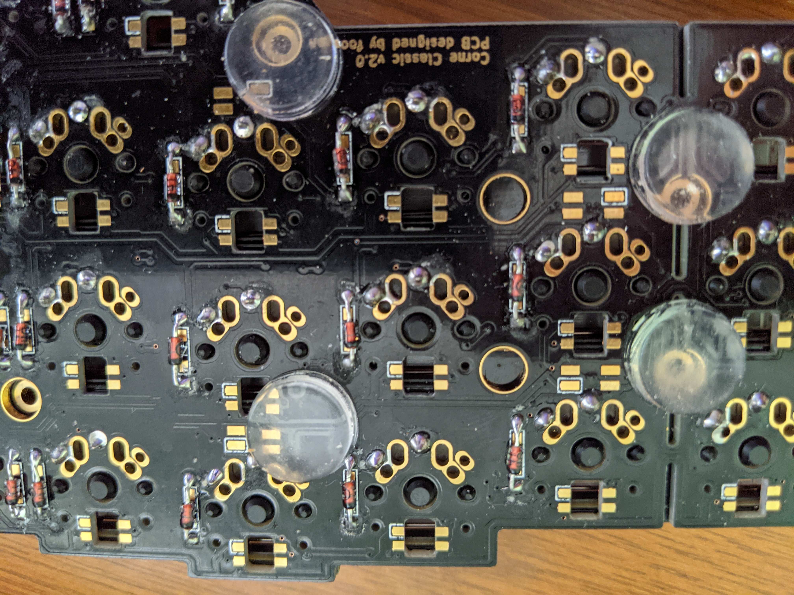
  <figcaption style="font-style: italic; font-size: 0.9em; color: #555; margin-top: 0.5em; padding: 0.3em; background-color: #f0f0f0; border-radius: 0 0 4px 4px;">
    The Corne PCB with per-key RGB lighting.
  </figcaption>
</figure>

<figure style="text-align: center; margin: 1.5em 0; padding: 0.5em; border: 1px solid #eee; background-color: #f9f9f9; border-radius: 4px; max-width: 100%;">
  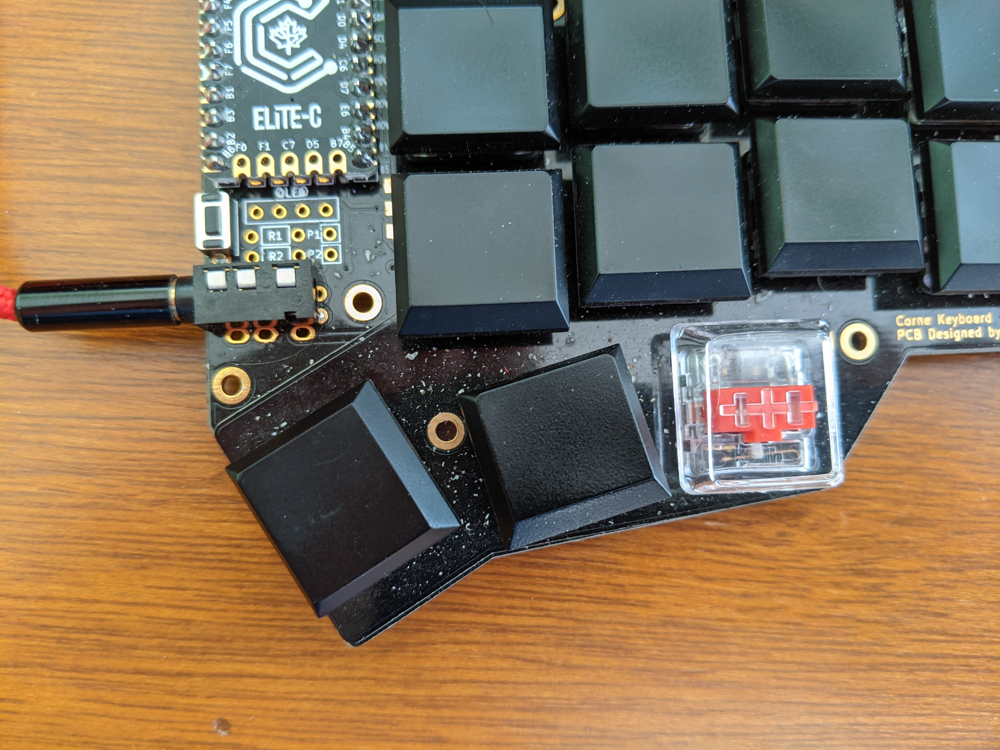
  <figcaption style="font-style: italic; font-size: 0.9em; color: #555; margin-top: 0.5em; padding: 0.3em; background-color: #f0f0f0; border-radius: 0 0 4px 4px;">
    Thumb cluster on the Corne keyboard.
  </figcaption>
</figure>

<figure style="text-align: center; margin: 1.5em 0; padding: 0.5em; border: 1px solid #eee; background-color: #f9f9f9; border-radius: 4px; max-width: 100%;">
  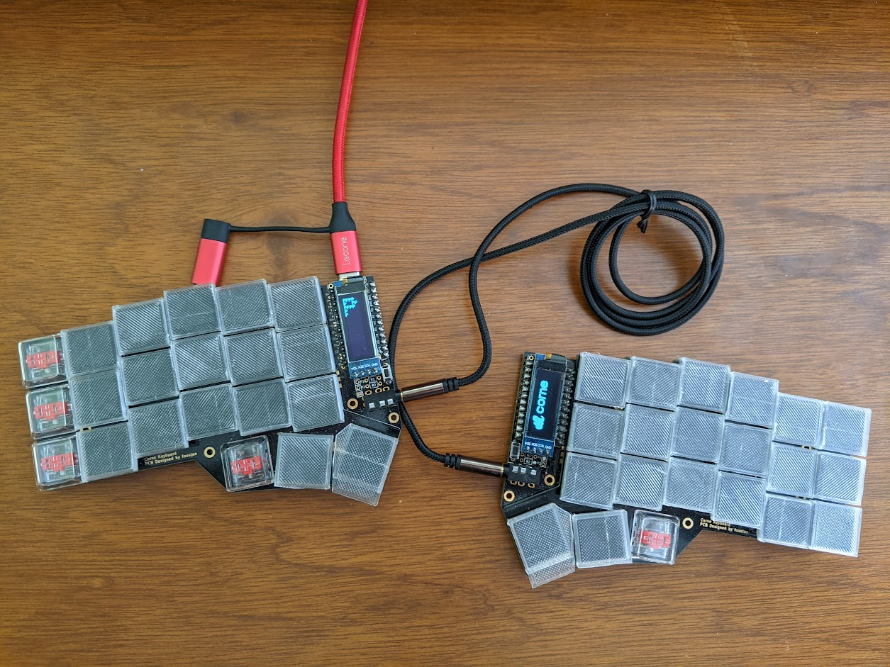
  <figcaption style="font-style: italic; font-size: 0.9em; color: #555; margin-top: 0.5em; padding: 0.3em; background-color: #f0f0f0; border-radius: 0 0 4px 4px;">
    Corne configured for stenography.
  </figcaption>
</figure>

### Kyria Keyboards

The Kyria is a split keyboard with support for OLEDs and rotary encoders.

<figure style="text-align: center; margin: 1.5em 0; padding: 0.5em; border: 1px solid #eee; background-color: #f9f9f9; border-radius: 4px; max-width: 100%;">
  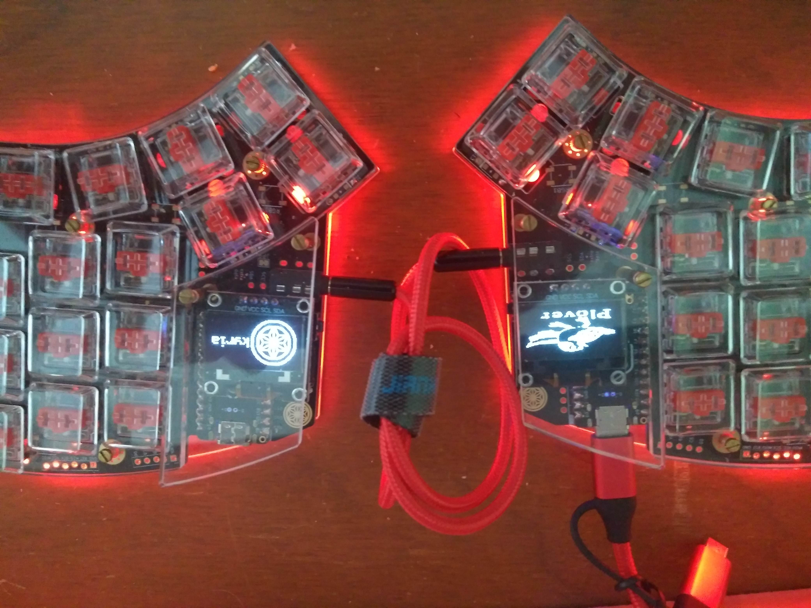
  <figcaption style="font-style: italic; font-size: 0.9em; color: #555; margin-top: 0.5em; padding: 0.3em; background-color: #f0f0f0; border-radius: 0 0 4px 4px;">
    Kyria with OLED displays and RGB backlighting.
  </figcaption>
</figure>

<figure style="text-align: center; margin: 1.5em 0; padding: 0.5em; border: 1px solid #eee; background-color: #f9f9f9; border-radius: 4px; max-width: 100%;">
  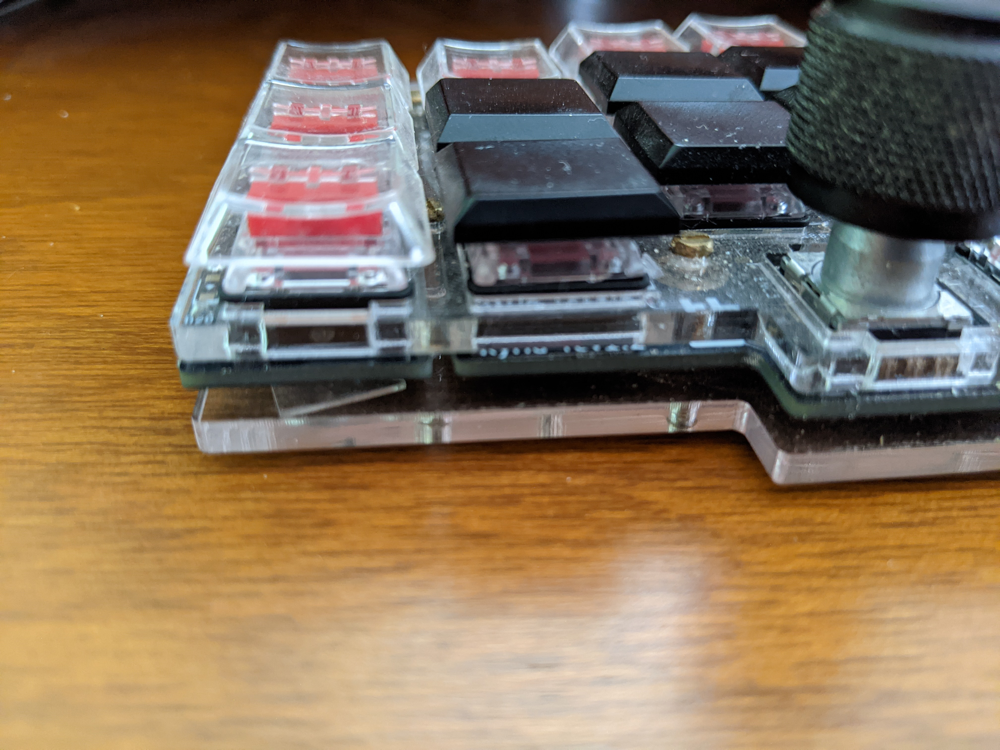
  <figcaption style="font-style: italic; font-size: 0.9em; color: #555; margin-top: 0.5em; padding: 0.3em; background-color: #f0f0f0; border-radius: 0 0 4px 4px;">
    Side view of Kyria showing the rotary encoder.
  </figcaption>
</figure>

<figure style="text-align: center; margin: 1.5em 0; padding: 0.5em; border: 1px solid #eee; background-color: #f9f9f9; border-radius: 4px; max-width: 100%;">
  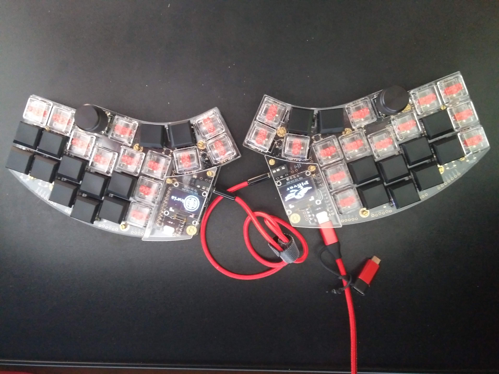
  <figcaption style="font-style: italic; font-size: 0.9em; color: #555; margin-top: 0.5em; padding: 0.3em; background-color: #f0f0f0; border-radius: 0 0 4px 4px;">
    Kyria configured with steno keycaps for chorded typing.
  </figcaption>
</figure>

### Georgi Keyboards

The Georgi is a compact split keyboard designed specifically for stenography.

<figure style="text-align: center; margin: 1.5em 0; padding: 0.5em; border: 1px solid #eee; background-color: #f9f9f9; border-radius: 4px; max-width: 100%;">
  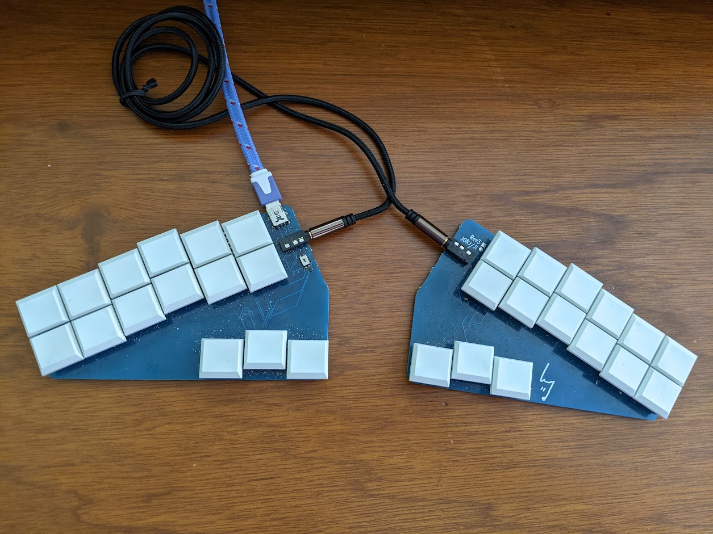
  <figcaption style="font-style: italic; font-size: 0.9em; color: #555; margin-top: 0.5em; padding: 0.3em; background-color: #f0f0f0; border-radius: 0 0 4px 4px;">
    The Georgi, a dedicated steno keyboard.
  </figcaption>
</figure>

<figure style="text-align: center; margin: 1.5em 0; padding: 0.5em; border: 1px solid #eee; background-color: #f9f9f9; border-radius: 4px; max-width: 100%;">
  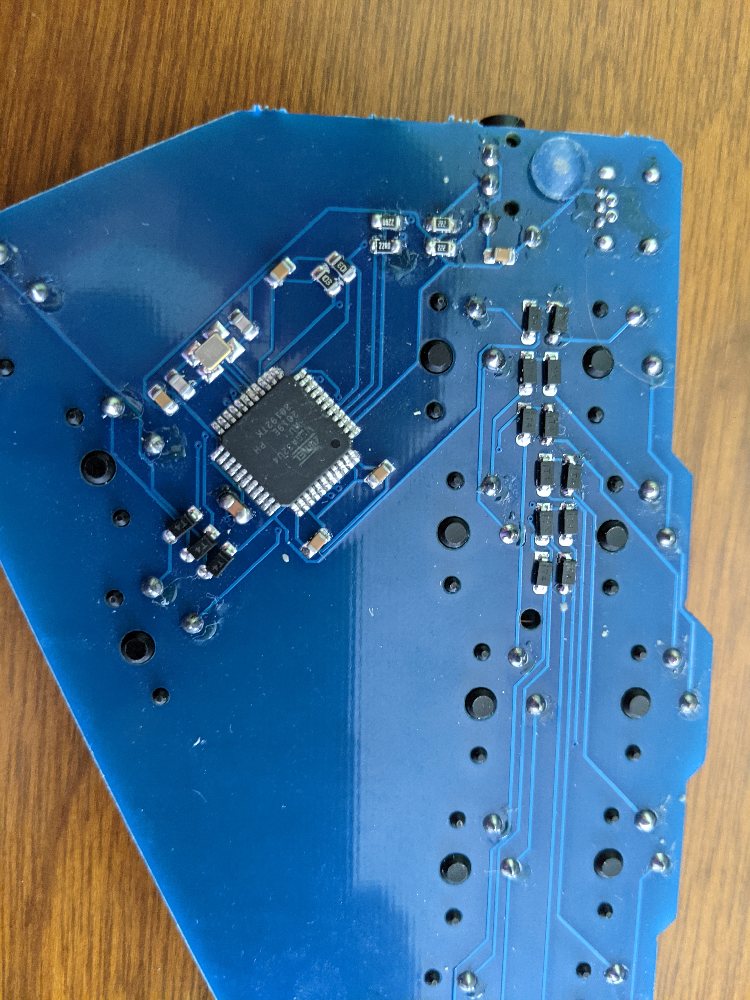
  <figcaption style="font-style: italic; font-size: 0.9em; color: #555; margin-top: 0.5em; padding: 0.3em; background-color: #f0f0f0; border-radius: 0 0 4px 4px;">
    Georgi PCB with NKRO (N-Key Rollover) support for steno.
  </figcaption>
</figure>

---

## Comparisons

These comparison photos help visualize the size and layout differences between various keyboard models.

<figure style="text-align: center; margin: 1.5em 0; padding: 0.5em; border: 1px solid #eee; background-color: #f9f9f9; border-radius: 4px; max-width: 100%;">
  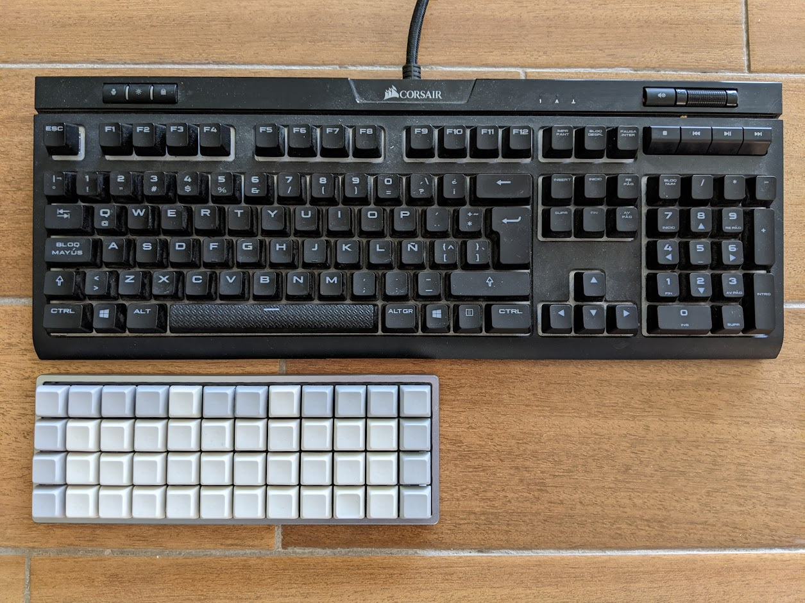
  <figcaption style="font-style: italic; font-size: 0.9em; color: #555; margin-top: 0.5em; padding: 0.3em; background-color: #f0f0f0; border-radius: 0 0 4px 4px;">
    Full-size 100% keyboard compared to a compact 40% keyboard.
  </figcaption>
</figure>

<figure style="text-align: center; margin: 1.5em 0; padding: 0.5em; border: 1px solid #eee; background-color: #f9f9f9; border-radius: 4px; max-width: 100%;">
  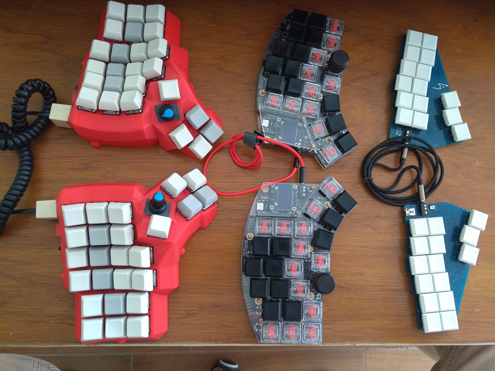
  <figcaption style="font-style: italic; font-size: 0.9em; color: #555; margin-top: 0.5em; padding: 0.3em; background-color: #f0f0f0; border-radius: 0 0 4px 4px;">
    Split keyboards comparison: Dactyl Manuform, Kyria, and Georgi.
  </figcaption>
</figure>

<figure style="text-align: center; margin: 1.5em 0; padding: 0.5em; border: 1px solid #eee; background-color: #f9f9f9; border-radius: 4px; max-width: 100%;">
  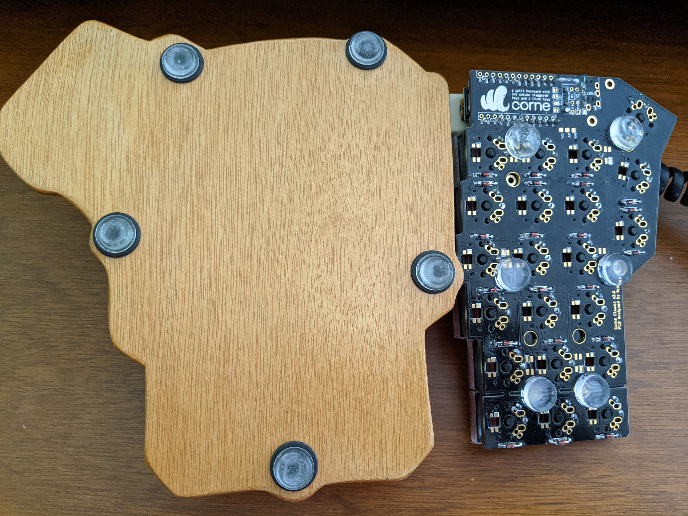
  <figcaption style="font-style: italic; font-size: 0.9em; color: #555; margin-top: 0.5em; padding: 0.3em; background-color: #f0f0f0; border-radius: 0 0 4px 4px;">
    Desk footprint comparison: Dactyl Manuform vs. Corne.
  </figcaption>
</figure>

<figure style="text-align: center; margin: 1.5em 0; padding: 0.5em; border: 1px solid #eee; background-color: #f9f9f9; border-radius: 4px; max-width: 100%;">
  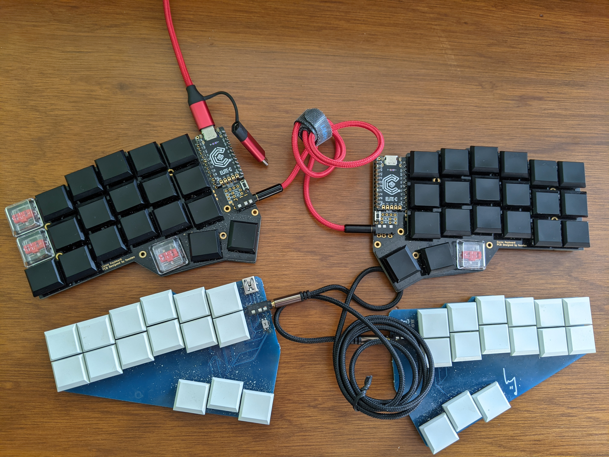
  <figcaption style="font-style: italic; font-size: 0.9em; color: #555; margin-top: 0.5em; padding: 0.3em; background-color: #f0f0f0; border-radius: 0 0 4px 4px;">
    Corne and Georgi side by side.
  </figcaption>
</figure>

---

## Workspace Setups

How do these keyboards fit into real workspaces?

<figure style="text-align: center; margin: 1.5em 0; padding: 0.5em; border: 1px solid #eee; background-color: #f9f9f9; border-radius: 4px; max-width: 100%;">
  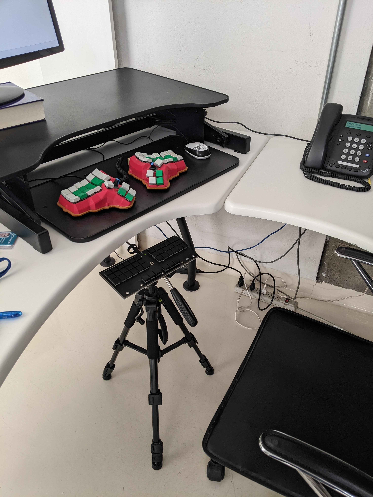
  <figcaption style="font-style: italic; font-size: 0.9em; color: #555; margin-top: 0.5em; padding: 0.3em; background-color: #f0f0f0; border-radius: 0 0 4px 4px;">
    Testing different keyboards in a real workspace.
  </figcaption>
</figure>

<figure style="text-align: center; margin: 1.5em 0; padding: 0.5em; border: 1px solid #eee; background-color: #f9f9f9; border-radius: 4px; max-width: 100%;">
  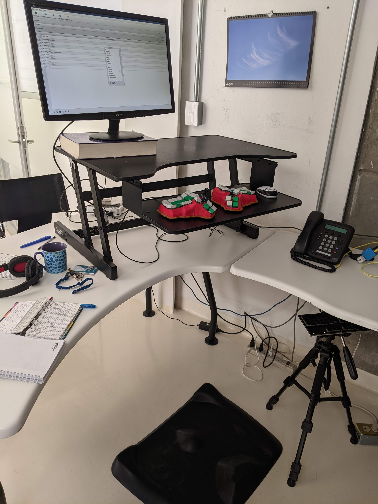
  <figcaption style="font-style: italic; font-size: 0.9em; color: #555; margin-top: 0.5em; padding: 0.3em; background-color: #f0f0f0; border-radius: 0 0 4px 4px;">
    Standing desk setup with Dactyl Manuform and multisteno for maximum productivity.
  </figcaption>
</figure>

<figure style="text-align: center; margin: 1.5em 0; padding: 0.5em; border: 1px solid #eee; background-color: #f9f9f9; border-radius: 4px; max-width: 100%;">
  
  <figcaption style="font-style: italic; font-size: 0.9em; color: #555; margin-top: 0.5em; padding: 0.3em; background-color: #f0f0f0; border-radius: 0 0 4px 4px;">
    Multisteno mounted on a tripod for optimal positioning.
  </figcaption>
</figure>

---

## Miscellaneous Keyboards and Accessories

<figure style="text-align: center; margin: 1.5em 0; padding: 0.5em; border: 1px solid #eee; background-color: #f9f9f9; border-radius: 4px; max-width: 100%;">
  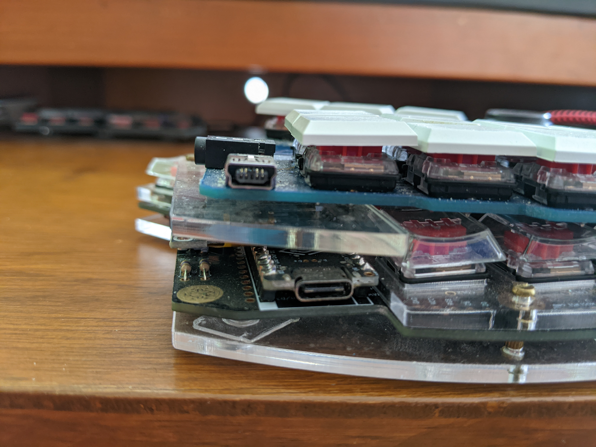
  <figcaption style="font-style: italic; font-size: 0.9em; color: #555; margin-top: 0.5em; padding: 0.3em; background-color: #f0f0f0; border-radius: 0 0 4px 4px;">
    A collection of keyboards: Kyria, Corne, and others.
  </figcaption>
</figure>

<figure style="text-align: center; margin: 1.5em 0; padding: 0.5em; border: 1px solid #eee; background-color: #f9f9f9; border-radius: 4px; max-width: 100%;">
  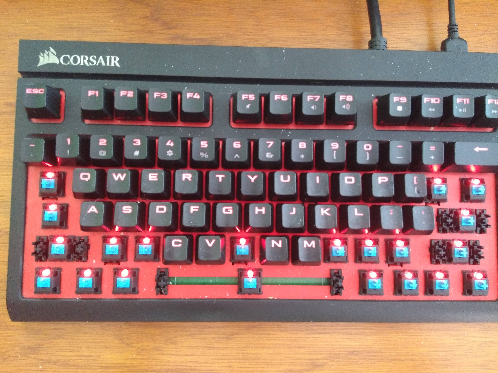
  <figcaption style="font-style: italic; font-size: 0.9em; color: #555; margin-top: 0.5em; padding: 0.3em; background-color: #f0f0f0; border-radius: 0 0 4px 4px;">
    Keycaps can be easily swapped to change the look and feel of your keyboard.
  </figcaption>
</figure>

<figure style="text-align: center; margin: 1.5em 0; padding: 0.5em; border: 1px solid #eee; background-color: #f9f9f9; border-radius: 4px; max-width: 100%;">
  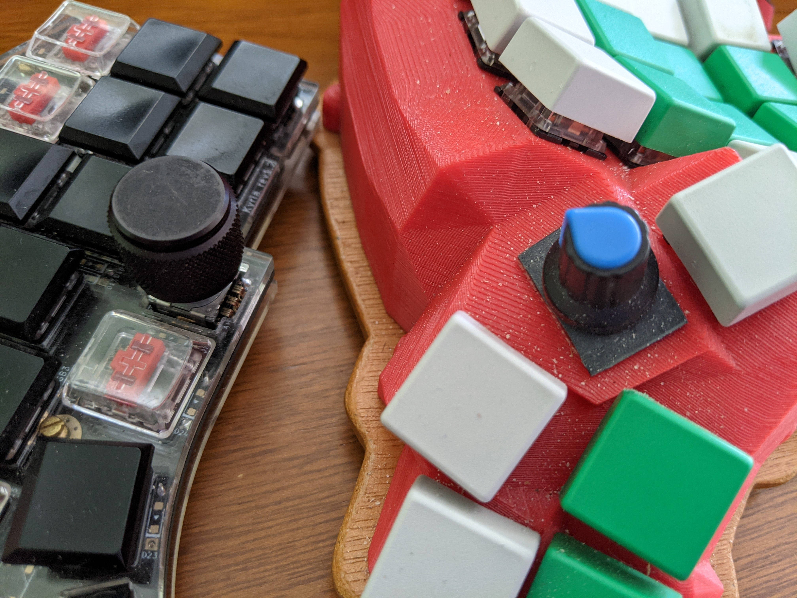
  <figcaption style="font-style: italic; font-size: 0.9em; color: #555; margin-top: 0.5em; padding: 0.3em; background-color: #f0f0f0; border-radius: 0 0 4px 4px;">
    Rotary encoders provide analog input for volume, scrolling, and other controls.
  </figcaption>
</figure>
