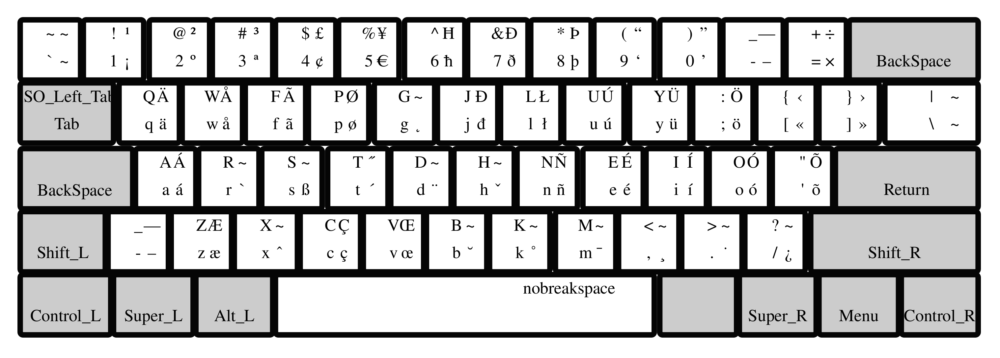
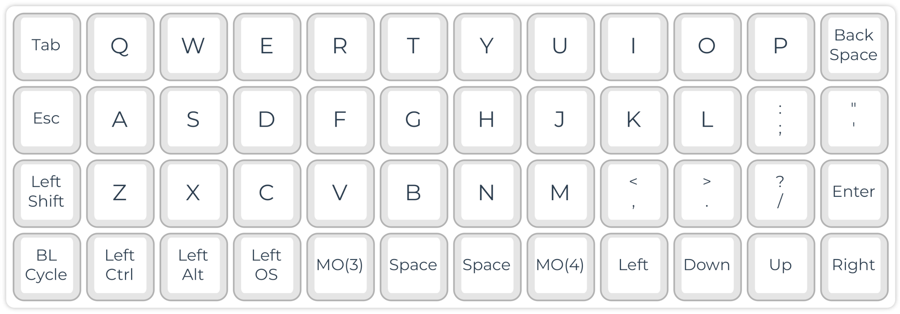

# The Hardware: Taxonomy of Keyboard Types

The keyboard is our primary tool for generating and editing text. In addition, we can use a keyboard to navigate a document and control computer functions.

Your ideal keyboard depends a lot on its use. For example, a novel writer needs different features than a gamer, accountant, or programmer.

> **Hack:** Get a gamer keyboard with linear mechanical keys. This is the simplest and fastest way for improving your typing experience.

## Functional Groups

### Letters, Numbers, and Basic Symbols

For writing text, the letters of the alphabet must be available on the keyboard. As well, the numbers `1`, `2` ... `0`, punctuation (`,`, `.`, `?`, ...), and basic symbols such as `$` are helpful for efficient text input.

However, standard keyboard layouts are country- and language-specific. For example, German keyboards have letters such as `ä` and `ß`, whereas Spanish keyboards have letters with different diacritics (`é`, `ñ`) and additional punctuation symbols (`¿`, `¡`). Multilingual writing is therefore challenging and requires, for example, operating-system-specific switching of keyboard layouts.

> **Hack:** The Colemak layout is not only more ergonomic, but also adds many letters and symbols for multilingual typing out-of-the-box (see figure above).

### Editing, Control, and Modifier Keys

### Number (NUM)-Keys Block

| 7 | 8 | 9 | /  |
|---|---|---|----|
| 4 | 5 | 6 | *  |
| 1 | 2 | 3 | -  |
| # | 0 | . | +  |

*A compact laptop number block for the input of numbers and basic math operations. The `#` symbol represents the NUM-LOCK key for toggling the number block functions.*

### Function (F)-Keys Block

`F1` `F2` `F3` ... `F12`

### Cursor Keys

> **Hack:** Define four keys in a row as cursor keys. Ideally, your fingers do not have to change row or column for moving the cursor.

For the Cursor-key Row, all cursor keys are arranged in a row instead of positioning the up cursor above the down keys. This way, the fingers can remain in place, and the movements are faster and more ergonomic. The vim editor uses the letters 'hjkl' for moving in the text. On QWERTY keyboards, those keys are on the home row of the right hand. Of course, this is still not ideal, since the index finger has to be moved for reaching 'h'. Besides, you should not use the QWERTY layout.

You can define a modifier key (such as ALT) plus the four keys below your left/right hand in home position as cursor keys.

> **Hack:** Instead of moving your pinkie finger for each capital letter, you may program an autoshift function, e.g., using QMK on supported keyboards.

On typewriters, the complete mechanics needed to be shifted for having a second symbol available on each key. However, on computer keyboards, we still can find the shift keys. If you own a QMK programmable keyboard, you can define autoshift.

> **Hack:** For most users, the CAPS-LOCK key brings more trouble than benefit. Disable, or redefine it for something useful.

Consider changing the function of CAPS-LOCK to something more useful, e.g., a Backspace for your left hand.

---

## Common Keyboard Sizes

- **Size:** Most full-size (or 100%) keyboards have more than 100 keys and are far too large. An excess size is inconvenient because the fingers have to travel a lot. Thus, smaller keyboards are more ergonomic. About 50 keys are sufficient for the Latin alphabet and the most important symbols and control keys. Additional keys can be implemented using layers. Of course, smaller keyboards are also more portable.

> **Hack:** Simply choosing a smaller keyboard can improve your typing experience (ergonomic working and speed) because your fingers and hands need to move less.

---

## Anatomical Adaptation of Keyboards

### Keyboard Shapes

Working with our hands in parallel, palm down, with a short distance, is everything but natural. However, we have them shoulder-wide and with our palms slightly facing inside in a relaxed position.

### Use of Strong (Thumb) Instead of Weak (Pinkie) Fingers

- **Thumb:** Spacebar
- **Pinkie:** Enter, shift, backspace, multiple letters and symbols

### Staggered Layouts

Our fingers don't have the same lengths.

### Ortholinear Layout

### Tilting

Most standard keyboards come with plastic feet that allow tilting the keyboard towards the typist. Ergonomically, this is the worst option for the wrists. It is preferable to lay the keyboard flat. You can even try a slightly negative tilt in case of wrist problems.

### Tenting

Our hands are not parallel to the plane but form a tent-like angle in a resting position. Some typists, therefore, prefer tenting their typically split keyboards. This is done in the simplest case with some cardboard. In addition, there are commercial and DIY keyboards with adjustable tenting. The 3D-printable Dactyl (Manuform) keyboard even tries to resemble the anatomical form and tenting of the hands as closely as possible.

**Design:** Diagonal movements of our fingers cause strain, which slows down our typing speed and is tiring. Therefore, modern keyboards arrange the keys in an ortholinear or matrix geometry. A better position of the wrists can be reached with split and tented keyboards.

**Layout:** The QWERTY keyboard layout is far from ideal since the fingers must move from their standard position for reaching frequent letters such as E, R, and T. Learning an alternative layout is not difficult. I use the Colemak layout, which is excellent for multilingual typing. Other simple hacks make typing easier, such as autoshift and home-row cursor movement. Thus, the keyboard should be programmable.

**NKRO Capability:** This is for real nerds now. You can multiply your typing speed by learning steno (see below). However, you need an NKRO-capable keyboard because it needs to register the synchronous pressing of several keys.

**Switches and Keycaps:** Ideally, you choose the switches according to your preferences. If you plan to use the keyboard for steno, you should consider low-profile switches with a low required force. You can get light springs for doing a 'spring mod' for some switches. For steno, flat keycaps are also highly recommendable.

**Nerd Features:** You may add OLED displays, encoders, and background illumination to your keyboard. However, most of these features are optional and might increase your light bill.

My daily driver is a Corne split keyboard, steno compatible. The split layout with only 21 keys on each side makes it very ergonomic and portable.

- Keyboard: LittleKeyboards Corne
- 2 x Elite C controller
- Kailh low profile red switches with 15 g spring mod
- Analyst PCB case

---

## Keyboard Examples

