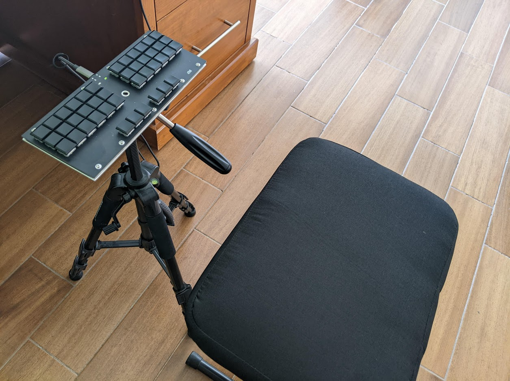

# Productivity: It's Not Only the Typing!

For productive writing, the conditions are crucial. First of all, you need to dedicate time for focused work [@newport_deep_2013]. Spoiler: You should quit social networks. And - not very modern - you should be unavailable for visitors.

Stephen King recommends in his excellent book about his life and writing [@king_writing_2020]:

> *"Write with the door closed, rewrite with the door open. Your stuff starts out being just for you, in other words, but then it goes out. Once you know what the story is and get it right - as right as you can, anyway - it belongs to anyone who wants to read it. Or criticize it."*

To meet specific targets, such as finishing the thesis, within a limited timeframe, the *Pomodoro technique* can help [@cirillo_pomodoro_2018].

## Ergonomic Workspace

As the head of an international company, you need a corner office with a boss leather throne, a colossal mahogany writing desk, and some tiny visitor chairs for underlining your exposed position. However, for productive writing, the set-up shown in the figure below would be a better choice. There are also saddle-like chairs with rolls (you might have seen one with your physiotherapist).

Another tool for an ergonomic set-up is a standing desk; you can even vary and work certain times standing and sit if you get tired. For prolonged standing, a soft standing mat (special ones are also available with topology) is recommendable. A huge advantage of working standing: People understand that you are busy and do not sit down for a coffee chat.
