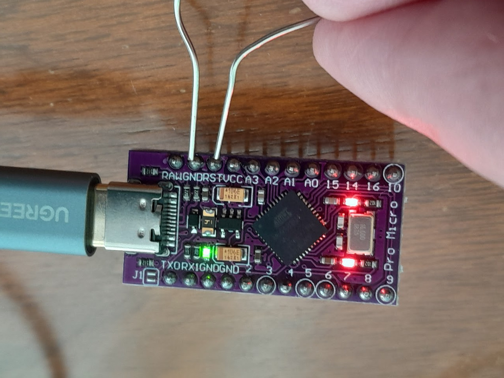

# Programming Keyboards

All right, you are serious and want to adopt the keyboard to your needs!

Naturally, first you need a programmable keyboard. Certainly, there might be provider-specific hardware-software solutions. But if you want to have full control, plenty of features, and support by a helpful and competent community, you should go for QMK [https://qmk.fm/](https://qmk.fm/).

Basically, all keyboards described in this book can be programmed with QMK, with the exception of commercial end-products. For example, if you try reprogramming your Apple or Corsair keyboard, probably you will feel very lonely.

On the other side, there are high-end keyboards, such as the Ergodox and the Multisteno, that come with QMK compatibility and provider support for reprogramming.

> **QMK** The QMK Configurator [@qmk-contributors_qmk_2022].

## Remapping

## Additional Features

## QMK Command Line Interface

### Prepare QMK

```bash
pipx install qmk
qmk setup
```

### Directory and File Structure

```
~/qmk_firmware/keyboards/handwired/dactyl_manuform/4x6/keymaps/colemakdh_dactyl-manuform-4x6/
```

```
config.h  
keymap.c  
rules.mk
```

> **Personal QMK Git Repository** You can create a Git repository for your personal QMK projects, and include the keyboard layouts into the `qmk_firmware/keyboards/` path with symbolic links. My QMK repository is at [https://github.com/robert-winkler/QMK.git](https://github.com/robert-winkler/QMK.git)

### Define Keyboard and Keymap

```bash
qmk config flash.keyboard=handwired/dactyl_manuform/4x6 flash.keymap=colemakdh_dactyl-manuform-4x6
```

### Flash Arduino

For a split keyboard, you need to flash the Arduino of each part.

```bash
qmk flash
```

Shortly connect the ground (GND) and reset (RST) pins of the Arduino for putting it into flashing mode.



## I'm Stuck, Bricked My Keyboard Software, etc.

Don't panic! Most programming issues will not permanently affect your keyboard. If you can't find the solution to your problem in the QMK documentation, you will find helpful people in the QMK Discord channel.
