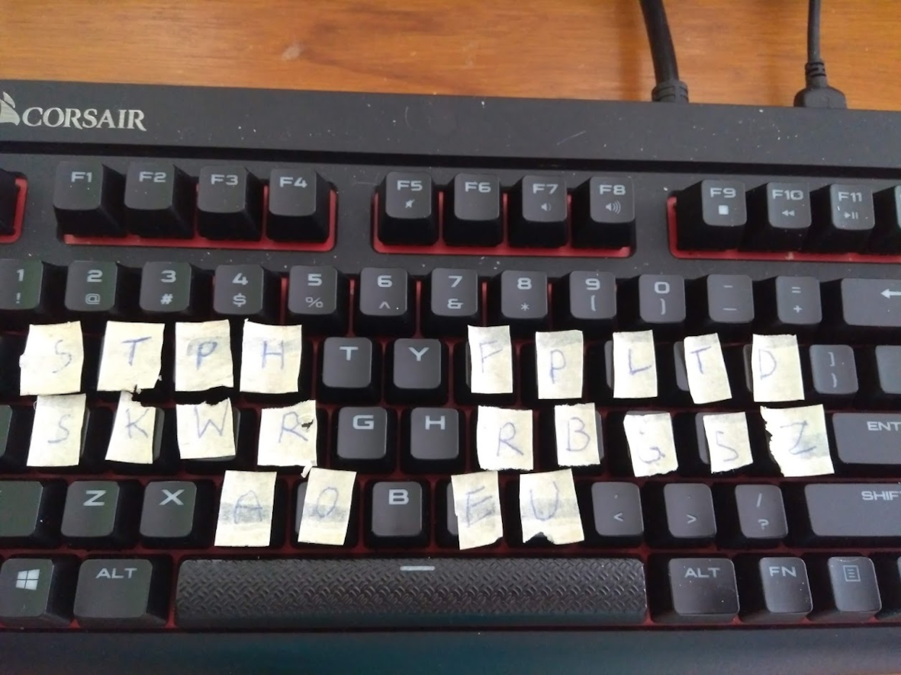
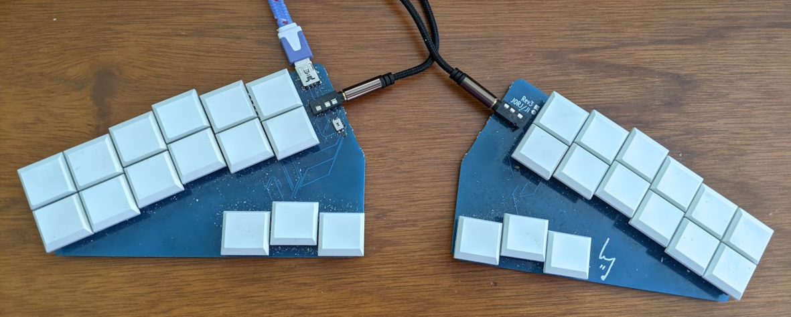
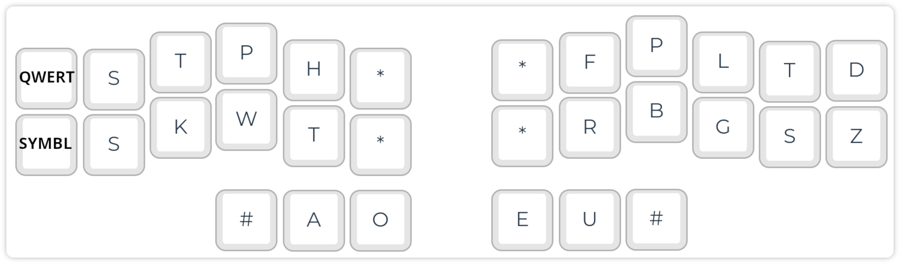

# Speaking-Speed Typing with Stenography

## Stenography with Plover

In stenography, the text is inserted using strokes instead of single letters. For example, pressing and releasing the keys "KP-L" writes the word "example."

The Open Steno Project: [http://www.openstenoproject.org/](http://www.openstenoproject.org/)

Software installation: [http://www.openstenoproject.org/plover/](http://www.openstenoproject.org/plover/)

> **Hack:** If you install Plover with `pip install plover-console-ui` you will get the latest Plover GUI version and the Plover console interface.

Starting point: [https://didoesdigital.com/project/plover/](https://didoesdigital.com/project/plover/)

Excellent training lessons: [https://didoesdigital.com/typey-type/](https://didoesdigital.com/typey-type/)

## Dictionaries

Getting help

Plover software

## Steno with an NKRO (QWERTY) Keyboard

For initial testing, you can test Plover with a normal NKRO keyboard. In figure below you can see my first experiments with a Corsair gaming keyboard. However, standard keycaps and switches are far from optimal for pressing multiple keys at once. For example, red Cherry MX switches are specified with an operating force of 45 cN. Pressing eight keys thus requires 360 cN!

The Georgi steno keyboard presented below uses flat keys with 12g switches ([https://www.gboards.ca/product/georgi](https://www.gboards.ca/product/georgi)).



## Low-cost Commercial and DIY Keyboards

[https://plover.wiki/index.php/Supported_Hardware](https://plover.wiki/index.php/Supported_Hardware)

[https://stenokeyboards.com/](https://stenokeyboards.com/)

The Georgi keyboard ([http://www.gboards.ca/product/georgi](http://www.gboards.ca/product/georgi)).





The Stenomod/TinyMod keyboard: [https://stenomod.blogspot.com/](https://stenomod.blogspot.com/)

Nolltronics Ecosteno and Multisteno: [https://nolltronics.com/](https://nolltronics.com/)

You can learn the basic concepts of Steno and Plover at [https://github.com/openstenoproject/plover/wiki/Learning-Stenography](https://github.com/openstenoproject/plover/wiki/Learning-Stenography). I recommend the *Learn Plover!* book (there are also EPUB and PDF versions), and training with Typey Type.

Cut, Copy and Paste:
- Cut: `KHR-BGS`
- Copy: `KHR-BG`
- Paste: `KHR-*F`

Editing:
- Backspace: `PW-FP`
- Delete: `TK*EL`
- Enter: `R-R`

Modifier keys: [http://www.openstenoproject.org/stenodict/dictionaries/lh_modifier_keys.html](http://www.openstenoproject.org/stenodict/dictionaries/lh_modifier_keys.html)

Left Hand Modifier Keys: Easily type SHIFT+ALT+q etc. with two strokes. After installing this Plover dictionary, you can use easy-to-remember stroke combinations such as:
- Undo: `KHR/STPKW` (KHR=Control, STPKW=Z)
- Paste unformatted text: `SKHR/SR` (SKHR=Shift+Control, SR=V)

Moving in the text:
- Cursor: `STPH-[R|P|B|G]`
- Word-by-word: `STPH-[RB|BG]`

Note: The cursor will move after releasing the keys...

Punctuation and symbols: A simple system for inserting most of the relevant symbols, with options for inserting spaces etc. Highly recommendable! [https://github.com/EPLHREU/emily-symbols](https://github.com/EPLHREU/emily-symbols)

Diacritics: [https://github.com/vatnid/plover-seoijin/blob/master/fingerspelling_diacritics.json](https://github.com/vatnid/plover-seoijin/blob/master/fingerspelling_diacritics.json)

## Modifiers

[https://github.com/4hrue2kd83f/plover-left-hand-modifiers](https://github.com/4hrue2kd83f/plover-left-hand-modifiers)

## Multilingual Stenography

### Diacritics

```json
diacritics.json
{
  "*FB": "{&̀}",
  "*FL": "{&̈}",
  "*FRPB": "{&̊}",
  "*RP": "{&́}",
  "*RPG": "{&̂}",
  "*RPGT": "{&̃}",
  "A*/*FB": "{>}{&à}",
  "A*/*FL": "{>}{&ä}",
  "A*/*FRPB": "{>}{&å}",
  "A*/*RP": "{>}{&á}",
  "A*/*RPG": "{>}{&â}",
  "A*/*RPGT": "{>}{&ã}",
  "A*/SKWRE": "{>}{&æ}",
  "A*P/*FB": "{-|}{&À}",
  "A*P/*FL": "{-|}{&Ä}",
  "A*P/*FRPB": "{-|}{&Å}",
  "A*P/*RP": "{-|}{&Á}",
  "A*P/*RPG": "{-|}{&Â}",
  "A*P/*RPGT": "{-|}{&Ã}",
  "A*P/SKWRE": "{-|}{&Æ}"
}
```

system-switching.json
```json
{ "TKPW-D": "{PLOVER:SWITCH_SYSTEM:Regenpfeifer}", "TKPWE": "{PLOVER:SWITCH_SYSTEM:English Stenotype}", "TKPW-P": "{PLOVER:SWITCH_SYSTEM:Spanish System (eo variant)}" }
```

## Plover and Vim

Plover steno also

```json
logi-vim.json
{
  "STPR-B": "{#Down}",
  "STPR-BGS": "{^}{#Escape}{^}",
  "STPR-G": "{#Up}",
  "STPR-R": "{#Left}",
  "STPR-S": "{#Right}",
  "STPR-SZ": "{^}{#Escape}{^}:wq{#Return}"
}
```

## Plover Plugins

- plover-plugins-manager (0.7.1)
- plover-console-ui (1.2.1)
- plover-regenpfeifer (0.0.3)
- plover-spanish-system-eo-variant (0.3.0)
- plover-system-switcher (0.0.2)

## Before Giving Up with Plover Stenography

Learning Plover steno is hard, and many learners give up early, because it takes weeks to months until one can write even basic texts with QWERTY speed. As soon as you reach the "break-even" point, i.e., a level suitable for practical use, you wouldn't go back, because writing words letter-by-letter is so stupid...

If you feel frustrated, visit the Plover Discord channel. You are not alone with your beginner's difficulties and the community is very motivating.
